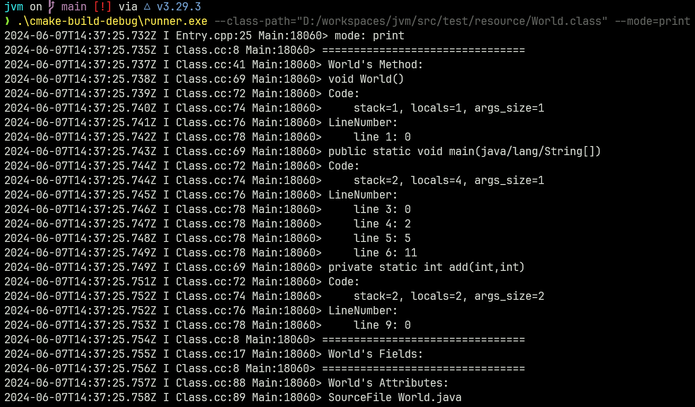
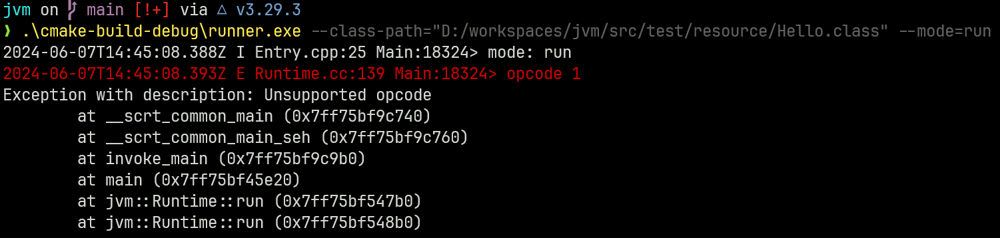

# JVM

This is an incomplete implementation, 
see the [Runtime.cc](./src/jvm/Runtime.cc) for instructions that are supported.

## Build

Config with vcpkg

```shell
cmake -Bbuild -DCMAKE_TOOLCHAIN_FILE=[path_to_vcpkg]/scripts/buildsystems/vcpkg.cmake
```

## Targets

All targets are depend on sese.

### jvm

JVM core implementation, including runtime and classloader.

### runner

JVM CLI implementation.

`--mode=(run|print)` Choose mode, default to run.

`--class-path=[file]` Choose the class file.

e.g.

<div align="center">

<p>print mode</p>

<p>unsupported opcode</p>
</div>

### test

Unittest for this project. Power by googletest.

## License

This project is for study and testing purposes only,
and itself is licensed under Apache 2.0.